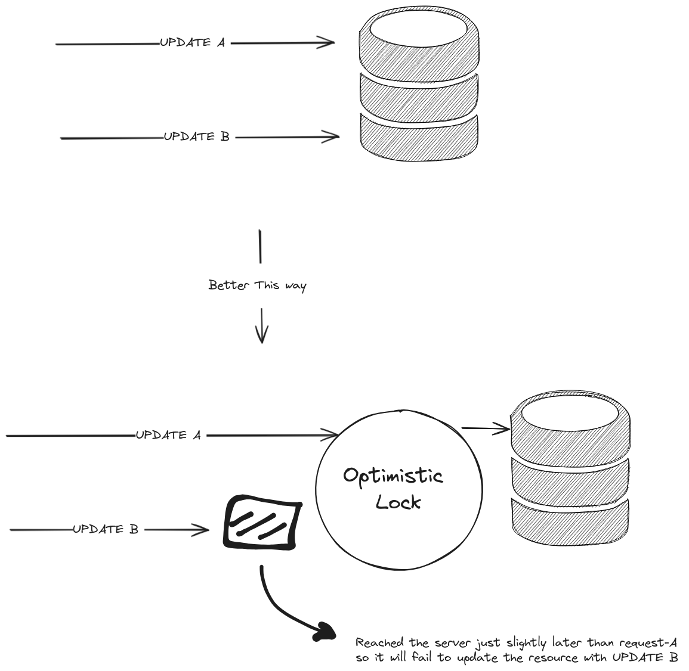
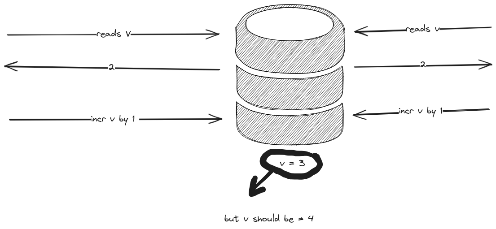
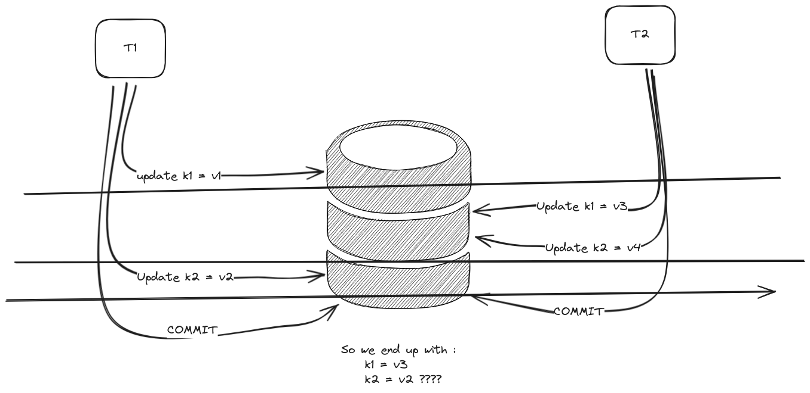
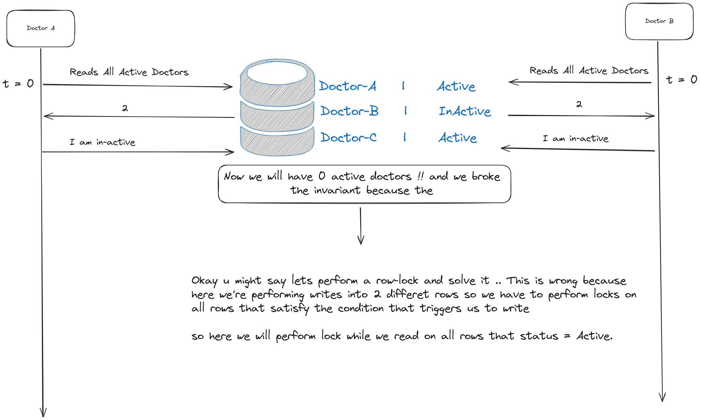

# interesting-backend-questions
Just taking notes about questions I'd love to be asked in my next interview 

# What should u do if you have a resource in your database, and 2 requests came at the same time, one needs to update field-x and the other to update field-y ?

# What do you know about indexes in database ?
- Hash Map Index 
    - stored in memory (RAM) so its not durable 
    - very fast O(1) for reads and write 
    - invalid for range queries [slow]

- BTrees index 
    - stored in disk (durable)
    - fast for reads, slow for writes 
    - valid for range queries [fast]

# could you explain the ACID transaction ?
- `Atomicity` :
    - All writes (insert - update - delete) fail togeather or succeed togeather.

- `Consistency` : 
    - we cannot have a corrupted data, and this is achieved by enforcing atomicity 
    - EXAMPLE : 
        * we must have one devops engineer at office at a time 
        * Dev-X takes a break 
        * Delete Dev-X from on-duty field 
        * Server crashes before Inserting Dev-Y 
        * NOW WE HAVE INCONSISTENT DATA 

- `Isolation` : 
    - a DB that satisfy the ACID couldn't have a race-condition 
    

- `Durability` : 
    - once i committed a write, i shouldn't lose it if server goes down.

    ### Okay how to achieve the ACID ?
        ACD : can be achieved by using a WAL 

# Explain the Isolation Levels ?
### Dirty Write :

    - Dirty write is simple writing new data over an uncommitted written data from another TX.

#### How to fix Dirty-Write ?
    - By using `row-locking`, but this maybe causes dead-lock 
    - EXAMPLE : 
        - TX_1 locks k1 
        - TX_2 locks k2 
        - TX_2 tries to lock k1 but failed 
        - TX_1 tries to lock k2 but failed 
        - [DEADLOCK]

    - SOLUTION: 
        - perform row locking by order of the key 
            - TX_1 locks k1 
            - TX_2 tries to lock k1 but failed 
            - TX_2 now stucks untill lock k1 is released so it cannot lock k2  
            - TX_1 locks k2 .. finishs .. release ... commit 
            - TX_2 can continue by lcoking on k1 and then k2  

### Write Skew : 

# Kafka 
### What is the size of data a single broker can store ? and what is the number of msgs per second a broker can receive ?
- A broker can store 1TB of data
- A broker can receives 10,000 msgs per second